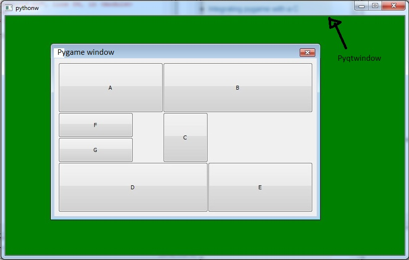
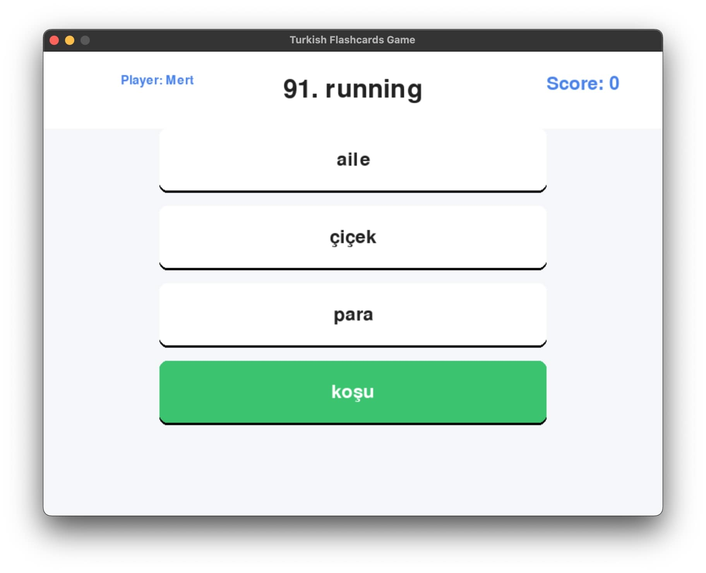

:warning: Everything between << >> needs to be replaced (remove << >> after replacing)

# Turkish Flashcards Game
## CS110 Final Project Fall 2024

## Team Members

Mert Kanibir

***

## Project Description

The Turkish Language Flashcard Game is an interactive educational application designed to help users learn Turkish vocabulary through an engaging quiz-style interface. The game presents users with English words and challenges them to select the correct Turkish translation from multiple options, tracking their progress through a scoring system.

***    

## GUI Design

### Initial Design

### Final Design

## Program Design

### Features

1. Multiple CHoice Interface
2. Score Tracking System
3. Menu Navigaton
4. Word Database Management
5. Basic UI Controls

### Classes

- << You should have a list of each of your classes with a description >>

## ATP

| Step | Procedure                                                                                  | Expected Results                                                  |
|------|--------------------------------------------------------------------------------------------|------------------------------------------------------------------|
| 1    | Run the game program.                                                                      | A GUI window appears with the title "Turkish Flashcards Game".   |
| 2    | On the welcome screen, click the "Start Game" button.                                      | The game starts and displays a flashcard with a word to translate. |
| 3    | Select the correct answer option from the displayed buttons.                               | Feedback message "Correct!" is displayed, and the score increases by 1. |
| 4    | Select an incorrect answer option from the displayed buttons.                              | Feedback message "Wrong!" is displayed, and the score remains unchanged. |
| 5    | Continue answering until no flashcards remain.                                             | The "Game Complete!" screen is displayed with the final score. |
| 6    | Navigate to the high scores screen via the menu.                                           | The high scores list is displayed, showing scores associated with usernames. |
| 7    | Press ESC while in the game to navigate back to the menu.                                  | The game screen pauses, and the menu appears.                  |
| 8    | Enter an invalid input (e.g., scrolling with the mouse wheel) while hovering over options. | No points are awarded, and the program handles the input gracefully. |
| 9    | Restart the game via the menu after completing a round.                                    | The game resets, and the score starts at 0.                    |
| 10   | Close the program by clicking the close button on the window.                              | The program exits without errors.                              |

### Test Coverage:
- **User Interactions:** Includes clicking buttons, navigating menus, and entering inputs.
- **Game Mechanics:** Covers selecting correct/incorrect options, scoring, and resetting the game.
- **Graphical Elements:** Tests GUI transitions between screens and feedback visibility.
- **Error Handling:** Validates input handling for unexpected actions (e.g., mouse wheel scrolling).
- **Persistence:** Verifies the high scores are correctly displayed and updated.